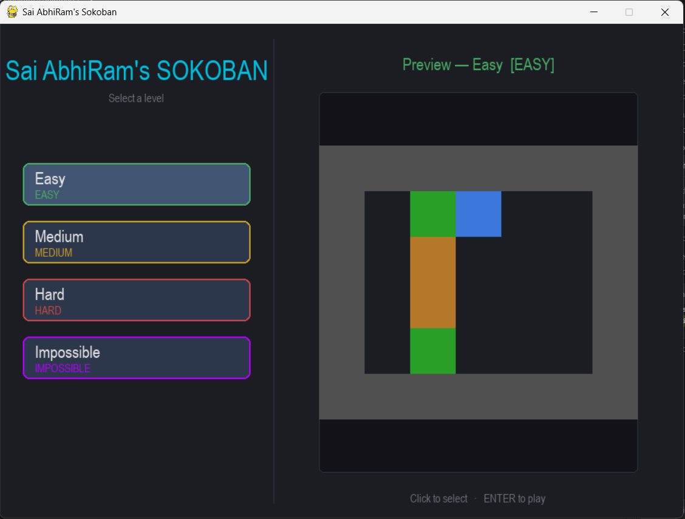

# Sai Abhiram's Sokoban

A classic Sokoban puzzle game built in Python with Pygame.

## Installation

```bash
git clone https://github.com/SaiAbhiRam9496/SOKOBAN.git
cd SOKOBAN
pip install -r requirements.txt
python main.py
```

## Controls

| Key                   | Action             |
|-----------------------|--------------------|
| Arrow keys            | Move player        |
| Z                     | Undo last move     |
| R                     | Reset level        |
| ESC                   | Back to menu       |
| ENTER                 | Confirm / Menu     |

## Levels

| Level     | Boxes | Difficulty |
|-----------|-------|------------|
| Easy      | 2     | Beginner   |
| Medium    | 3     | Moderate   |
| Hard      | 6     | Challenging|
| Impossible| 10    | Expert     |

## Outputs

Here are some visual outputs from the game:

### Home Screen


### Easy Level


### Medium Level


### Hard Level


### Impossible Level


## Project Structure

```
SOKOBAN/
├── main.py              # Entry point, game loop
├── requirements.txt
├── core/
│   ├── maps.py          # Level data and loader
│   └── sokoban.py       # Pure game logic (RL-ready)
├── ui/
│   ├── assets.py        # Image loader
│   ├── renderer.py      # In-game drawing
│   └── screens.py       # Menu and completion screen
├── assets/
│   ├── images/          # Tile sprites (update PNG files here to customize game representation)
│   └── sounds/
├── saves/
│   └── progress.json    # Best scores per level
├── outputs/             # Output files from gameplay or training
└── tests/
    └── test_sokoban.py
```

## Tech Stack

- Python 3.x
- Pygame 2.0+